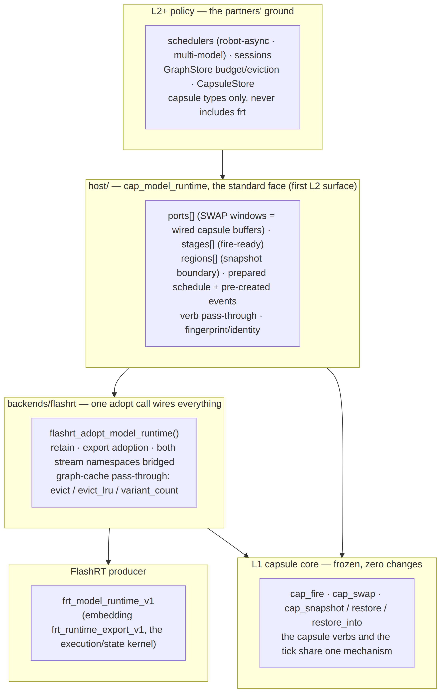

# The Standard Model-Runtime Face — Interface & Norms

Authoritative header: [`host/include/capsule/model_runtime.h`](../host/include/capsule/model_runtime.h).
This is the first **L2 (host/framework) surface**: schedulers, sessions, and
runtime loops code against it in capsule types only — never against the
FlashRT export or a model's pipeline.



## Adoption

```c
cap_model_runtime* m;
int rc = flashrt_adopt_model_runtime(model, &m);   /* frt_model_runtime_v1 in */
...
flashrt_model_close(m);                            /* releases everything     */
```

One call: validates the producer ABI, retains the model, adopts the embedded
FlashRT export (backend init, streams bridged across both namespaces,
graphs/buffers wrapped, regions materialized in contractual order), wires SWAP
port windows as capsule buffers, prepares the stage schedule, and pre-creates
the events that make the tick allocation-free.

## The struct (capsule types only)

| field | meaning |
|---|---|
| `backend` | initialized `cap_backend*` — pass to `cap_ctx_create`; capsules are stamped with the producer's fingerprint |
| `ports[]` | dynamic IO: name, modality/dtype/layout, direction, **update class** (`0 SWAP · 1 STAGED · 2 SETUP`), shape, and for SWAP the wired `cap_buffer` window |
| `stages[]` | the subgraph DAG as fire-ready entries: `cap_graph`, key, capsule stream index, `after[]` deps |
| `regions[]` | the restorable boundary, ready for `cap_boundary` / `cap_restore_into` (order is contractual) |
| `schedule` | prepared `cap_schedule` (cadence 1/1, `CAP_EVERY`) for `cap_drive_tick` users |
| `stage_events` | pre-created per depended-upon stage — what makes `cap_model_tick` allocation-free |
| `fingerprint` / `identity` | producer-computed; on a mismatch, print both identity strings to see why |
| `self` + verbs | producer pass-through: `set_input` / `get_output` (bytes) / `prepare` (warm) / `step` (sugar) / `last_error` |

## Driving a tick

```c
int obs = cap_model_find_port(m, "obs");
cap_swap(c, m->ports[obs].buffer, frame, n, m->stages[0].stream);  /* SWAP: µs   */
cap_model_set_input(m, prompt, text, len, -1);                     /* STAGED     */
cap_model_tick(c, m);                    /* whole DAG, allocation-free          */
/* — or schedule stages yourself: */
cap_model_fire(c, m, stage_index);       /* one stage; overlap across streams   */
```

`cap_model_tick` fires stages in declared order: cross-stream dependencies
wait on the pre-created events, same-stream dependencies ride FIFO order.
Hosts that overlap, interrupt, or re-order fire stages themselves — the DAG
is data, the loop is always yours.

## The hot-input contract (pinned by `tests/test_model_adopt.cpp`)

Updating SWAP or STAGED ports **between ticks** never recaptures, never
allocates, never rebinds graph pointers — replay output tracks buffer
contents, round after round. Warm-phase shape-bucket capture goes through the
producer's `prepare`, never inside a tick.

## Graph-cache mechanism vs policy

Eviction and budget **policy** (an L2 graph store: per-model quotas, global
budgets, warm sets) is built on the backend pass-through:

```c
flashrt_graph_evict(be, g, key);        /* drop one variant                  */
flashrt_graph_evict_lru(be, g);         /* drop the least-recently replayed  */
flashrt_graph_variant_count(be, g);     /* budget accounting                 */
```

Discipline: evict only at a safe point — never while the variant may be in
flight on some stream (sync or wait its event first). Production graphs are
fixed-shape or bucket-keyed; hot-path misses fail loudly.

## FFI hosts

The flat accessors (`cap_model_backend`, `cap_model_find_port`,
`cap_model_port_buffer/bytes/update`, `cap_model_stage_stream`,
`cap_model_region_array/count`, `cap_model_set_input/get_output/last_error`)
let ctypes/dlopen hosts drive an adopted model without mirroring structs.
`tests/gate_pi05_model.py` is the reference: a real Pi0.5 policy re-seeded
per tick through its noise SWAP port, deterministic per seed, restore-exact.

## Threading & lifetime

One `cap_ctx` per thread (the core rule) applies unchanged. The consumer
holds one reference to the model runtime; the export reference is internal.
`flashrt_model_close` may run from any thread — a Python producer acquires
the GIL inside its release path.

## What does NOT belong here

No session, no cadence policy, no modality processing, no protocol. This
header is data + pass-through verbs + lookups; everything above it is
pluggable policy, everything below it is the frozen core and the backend
seam. See [`CONTRIBUTING.md`](../CONTRIBUTING.md) for the red lines.
